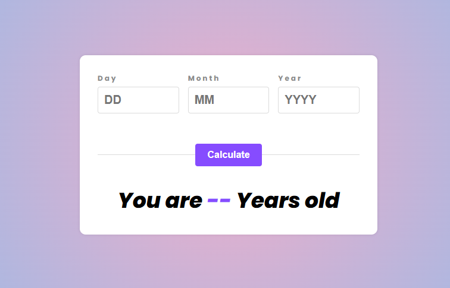

# Age Calculator App

A modern, interactive, and responsive age calculator web application that calculates your age based on the input date. Built with **HTML**, **CSS**, and **JavaScript**, this project demonstrates clean code practices, input validation, and dynamic UI updates.

---

## 📸 Screenshots

---

## ✨ Features

### 📅 **Date Validation**
- Validates day, month, and year inputs in real-time.
- Checks for:
  - Valid day ranges (1-31).
  - Valid month ranges (1-12).
  - Valid year ranges (1900-current year).
  - Future dates (displays error if date is in the future).
  - Invalid dates (e.g., 31 February).

### 🎯 **Age Calculation**
- Calculates precise age in years.
- Handles edge cases:
  - Birthdays in the current month.
  - Leap years.
  - Month-end dates.

### 🎮 **Interactive UI**
- **Enter Key Support**: Calculate age by pressing Enter.
- **Error Handling**: Displays clear error messages for invalid inputs.
- **Dynamic Results**: Updates results instantly.
- **Responsive Design**: Works seamlessly on all devices.

### 🛠️ **Technical Features**
- **Modular JavaScript Code**: Separation of validation, calculation, and UI logic.
- **CSS Variables**: Consistent styling across the app.
- **Flexbox Layout**: Responsive and flexible design.

---

## 🛠️ Technologies Used

### Frontend
- **HTML5**: For structuring the app.
- **CSS3**: For styling and animations.
- **JavaScript**: For logic and interactivity.

### Tools
- **Google Fonts**: Poppins font for modern typography.
- **CSS Variables**: For consistent color schemes.
- **Flexbox**: For responsive layouts.

---

## 🔍 Code Overview

### HTML Structure
The HTML file (`index.html`) contains:
- A form with three input fields (day, month, year).
- A button to trigger the calculation.
- A result section to display the age.

### CSS Styling
The CSS file (`style.css`) includes:
- Modern styling using CSS variables.
- Responsive design with Flexbox.
- Error states for invalid inputs.

### JavaScript Logic
The JavaScript file (`script.js`) handles:
1. **Input Validation**:
   - Checks if the day, month, and year are valid.
   - Displays error messages for invalid inputs.

2. **Age Calculation**:
   - Uses the `Date` object to calculate the age.
   - Handles edge cases like leap years and month-end dates.

3. **Event Listeners**:
   - Listens for button clicks and Enter key presses.
   - Updates the UI dynamically.

